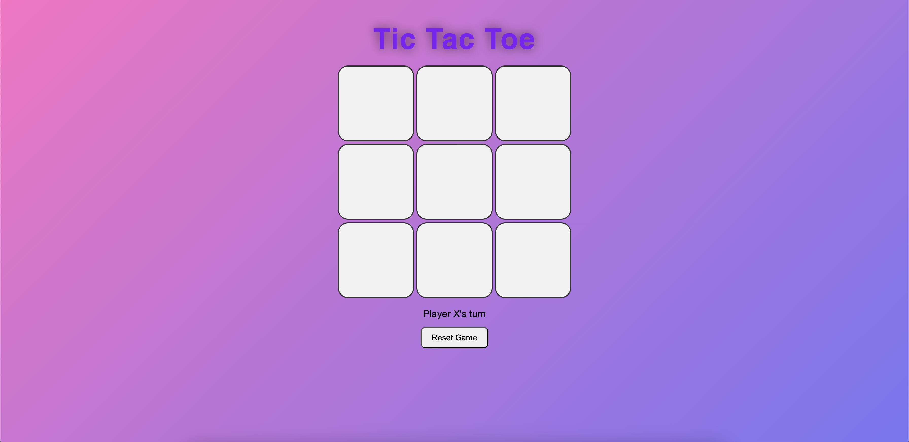
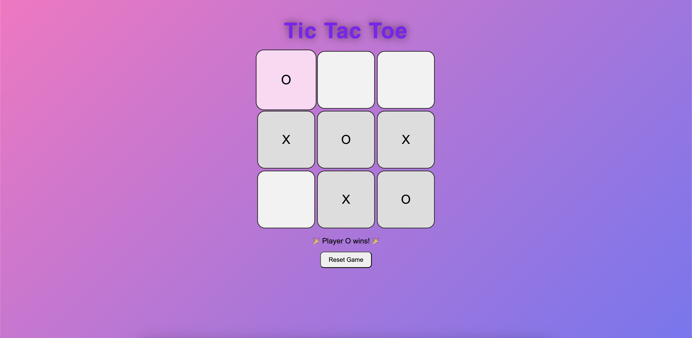

# 🎮 Tic-Tac-Toe

Interact with this simple tic-tac-toe game built with **HTML, CSS, and JavaScript**.

---

## ✨ Features

* Two-player mode (X vs O)
* Interactive grid with click-to-play
* Visual feedback for winners and ties
* Audio feedback for when a player wins
* Reset button to start a new game
* OOP used for the player, game and board
---

## 🚀 Getting Started

### 1. Clone the repository

```bash
git clone https://github.com/angy255/tic-tac-toe.git
```

### 2. Open the project

Go into the project folder:

```bash
cd tic-tac-toe
```

### 3. Run the game

Open `index.html` in your favorite browser.
That’s it — no build tools or server needed.

---

## 🛠️ Built With

* **HTML5** – structure of the game
* **CSS3** – styling and layout
* **JavaScript** – game logic

---

## 📸 Screenshot

```

```

---

```

```
---

## 🤝 Contributing

Contributions are welcome! If you’d like to improve the game (AI opponent, animations, etc.), feel free to fork the repo and submit a pull request.

---